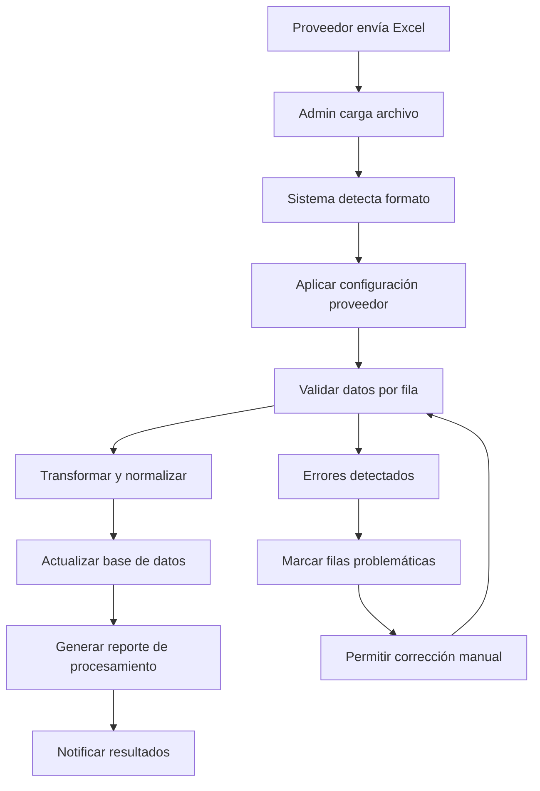

# ChefMax LATAM - Sistema Integral de Gestión de Inventarios y Cotizaciones

[](https://opensource.org/licenses/MIT)
[](https://nodejs.org/)
[](https://postgresql.org/)
[](https://reactjs.org/)
[](https://typescriptlang.org/)

## 🌐 Visión General

ChefMax LATAM es una plataforma integral diseñada para revolucionar la gestión de inventarios y cotizaciones en la industria gastronómica de América Latina. Especializada en el procesamiento inteligente de múltiples formatos de Excel de proveedores, unificando datos heterogéneos en un sistema centralizado y estandarizado.

### 🎯 Propósito del Sistema

El sistema resuelve el desafío crítico de **consolidar inventarios de múltiples proveedores** que utilizan diferentes formatos de Excel, permitiendo:

- **Unificación de Datos**: Procesamiento inteligente de formatos diversos de proveedores
- **Gestión Centralizada**: Base de datos única para todos los productos e inventarios
- **Cotizaciones Dinámicas**: Generación automática de cotizaciones personalizadas
- **Escalabilidad**: Arquitectura preparada para crecimiento regional en LATAM

## 🏗️ Arquitectura del Sistema

### Estructura de Directorios

```
chefmax/
├── README.md                    # Documentación principal
├── back/                        # Backend API (Node.js + TypeScript)
│   ├── src/
│   │   ├── config/             # Configuración de BD y Redis
│   │   ├── controllers/        # Lógica de controladores
│   │   ├── middleware/         # Autenticación y validación
│   │   ├── models/             # Modelos de datos
│   │   ├── routes/             # Definición de rutas API
│   │   ├── services/           # Lógica de negocio
│   │   ├── processors/         # Procesadores de Excel multi-formato
│   │   ├── database/           # Migraciones y seeds
│   │   └── types/              # Definiciones TypeScript
│   ├── package.json
│   └── tsconfig.json
├── front/                       # Frontend (React + TypeScript)
│   ├── src/
│   │   ├── components/         # Componentes reutilizables
│   │   ├── pages/              # Páginas de la aplicación
│   │   ├── hooks/              # Custom hooks
│   │   ├── services/           # Servicios API
│   │   ├── utils/              # Utilidades
│   │   └── types/              # Tipos TypeScript
│   ├── package.json
│   └── tailwind.config.js
├── formats/                     # Ejemplos de formatos de proveedores
│   ├── Fanny Fan.xlsx
│   └── Lily Cnix.xlsx
├── cotizaciones/               # Ejemplos de cotizaciones
│   └── COTIZACIONES FINALES...xlsx
└── marketing/                  # Materiales de branding
    ├── chefmax latam presentacion.pptx
    └── imágenes/
```

## 🔧 Stack Tecnológico

### Backend
- **Runtime**: Node.js 18.x
- **Framework**: Express.js con TypeScript
- **Base de Datos**: PostgreSQL 15.x con Knex.js ORM
- **Cache**: Redis para sesiones y cache
- **Autenticación**: JWT con roles (superadmin, admin, cliente, viewer)
- **File Processing**: ExcelJS + XLSX para procesamiento multi-formato
- **Real-time**: Socket.IO para actualizaciones en tiempo real
- **Documentación**: Swagger/OpenAPI 3.0

### Frontend
- **Framework**: React 18.x con TypeScript
- **Styling**: Tailwind CSS + Bootstrap (diseño tipo Apple)
- **State Management**: React Query + Context API
- **Routing**: React Router v6
- **Forms**: React Hook Form + Zod validation
- **UI Components**: Headless UI + Custom components

### DevOps & Deployment
- **Hosting**: Digital Ocean (Droplets + Spaces)
- **CI/CD**: GitHub Actions + doctl
- **Containers**: Docker + Docker Compose
- **Monitoring**: Winston logging + Sentry
- **SSL**: Let's Encrypt via Nginx

## 🚀 Funcionalidades Principales

### 1. **Procesamiento Inteligente de Excel Multi-Formato**

El corazón del sistema es el **ExcelProcessor**, capaz de:

- **Mapeo Configurable**: Cada proveedor tiene configuración personalizada de columnas
- **Validación Avanzada**: Reglas de validación por campo y proveedor
- **Transformación de Datos**: Normalización automática de precios, disponibilidad, etc.
- **Manejo de Errores**: Reportes detallados de filas procesadas vs fallidas
- **Procesamiento Asíncrono**: Cola de trabajos para archivos grandes

```typescript
// Ejemplo de configuración de proveedor
const supplierConfig: SupplierFormatConfig = {
  fileType: 'excel',
  sheetName: 'Productos',
  headerRow: 1,
  dataStartRow: 2,
  columnMapping: {
    productCode: 0,      // Columna A
    productName: 1,      // Columna B
    category: 2,         // Columna C
    price: 4,           // Columna E
    availability: 5      // Columna F
  },
  validationRules: [
    { field: 'productCode', type: 'required' },
    { field: 'price', type: 'numeric' }
  ]
};
```

### 2. **Sistema de Usuarios con Roles**

- **SuperAdmin**: Control total del sistema
- **Admin**: Gestión de inventarios y usuarios
- **Cliente**: Acceso a cotizaciones y catálogo
- **Viewer**: Solo lectura

### 3. **Interfaz de Administración Avanzada**

#### Sección de Inventarios
- **Múltiples Pestañas de Carga**: Interfaz para diferentes proveedores
- **Monitoreo en Tiempo Real**: Estado de procesamiento de archivos
- **Validación Visual**: Errores y advertencias por fila
- **Exportación Flexible**: Múltiples formatos de salida

#### Dashboard Analítico
- **Métricas de Inventario**: Stock, rotación, proveedores activos
- **Tendencias de Precios**: Análisis histórico por categoría
- **Performance de Proveedores**: Calidad de datos y tiempos de actualización

### 4. **Generación de Cotizaciones**

- **Templates Personalizables**: Diferentes formatos según cliente
- **Cálculo Automático**: Impuestos, descuentos, monedas
- **Versionado**: Historial de cambios en cotizaciones
- **Exportación Multi-formato**: PDF, Excel, envío por email

## 📊 Flujo de Negocio Detallado

### Proceso de Carga de Inventarios



### Arquitectura de Base de Datos

#### Tablas Principales

1. **users**: Gestión de usuarios y roles
2. **suppliers**: Configuración de proveedores
3. **products**: Catálogo unificado de productos
4. **file_uploads**: Historial de cargas de archivos
5. **quotations**: Sistema de cotizaciones
6. **inventory_items**: Control de stock

#### Relaciones Clave

```sql
-- Relación proveedor -> productos
products.supplier_id -> suppliers.id

-- Configuración flexible por proveedor
suppliers.format_config (JSONB) -> Configuración de procesamiento

-- Trazabilidad de cargas
file_uploads.processing_result (JSONB) -> Resultados detallados
```

## 🔐 Seguridad y Autenticación

### JWT con Refresh Tokens
- **Access Token**: 24 horas de duración
- **Refresh Token**: 7 días, rotación automática
- **Blacklist**: Redis para tokens revocados

### Rate Limiting
- **API General**: 100 requests/15min por IP
- **File Upload**: 5 archivos/min por usuario
- **Login**: 5 intentos/15min por IP

### Validación de Archivos
- **Tipos Permitidos**: .xlsx, .xls, .csv
- **Tamaño Máximo**: 50MB por archivo
- **Escaneo de Malware**: Integración con ClamAV

## 🌐 Deployment en Digital Ocean

### Infraestructura

```yaml
# docker-compose.prod.yml
version: '3.8'
services:
  backend:
    image: chefmax-back:latest
    environment:
      - NODE_ENV=production
      - DATABASE_URL=${DATABASE_URL}
      - REDIS_URL=${REDIS_URL}
    
  frontend:
    image: chefmax-front:latest
    environment:
      - REACT_APP_API_URL=https://api.chefmaxlatam.com
    
  postgres:
    image: postgres:15
    environment:
      - POSTGRES_DB=chefmax_db
    volumes:
      - postgres_data:/var/lib/postgresql/data
    
  redis:
    image: redis:7-alpine
    volumes:
      - redis_data:/data

  nginx:
    image: nginx:alpine
    ports:
      - "80:80"
      - "443:443"
    volumes:
      - ./nginx.conf:/etc/nginx/nginx.conf
      - ./ssl:/etc/ssl
```

### CI/CD Pipeline

```yaml
# .github/workflows/deploy.yml
name: Deploy to Digital Ocean

on:
  push:
    branches: [main]

jobs:
  deploy:
    runs-on: ubuntu-latest
    steps:
      - uses: actions/checkout@v3
      
      - name: Build and Deploy
        uses: digitalocean/action-doctl@v2
        with:
          token: ${{ secrets.DIGITALOCEAN_ACCESS_TOKEN }}
        run: |
          doctl apps create --spec .do/app.yaml
          doctl apps deploy ${{ secrets.APP_ID }}
```

## 🚀 Instalación y Desarrollo

### Prerrequisitos

```bash
# Versiones requeridas
node --version    # >= 18.0.0
npm --version     # >= 8.0.0
psql --version    # >= 15.0
redis-server --version # >= 7.0
```

### Setup Backend

```bash
cd back/
npm install
cp env.example .env

# Configurar base de datos
npm run db:migrate
npm run db:seed

# Desarrollo
npm run dev
```

### Setup Frontend

```bash
cd front/
npm install
cp .env.example .env.local

# Desarrollo
npm start
```

### Docker Development

```bash
# Levantar todos los servicios
docker-compose up -d

# Logs
docker-compose logs -f

# Rebuild
docker-compose build --no-cache
```

## 📈 Roadmap de Desarrollo

### Fase 1: Core MVP (Actual)
- ✅ Procesamiento multi-formato Excel
- ✅ Sistema de usuarios y roles
- ✅ API REST completa
- ✅ Interface básica de administración

### Fase 2: Mejoras UX/UI (Q2 2025)
- 🔄 Interface React robusta con Tailwind
- 🔄 Dashboard analítico avanzado
- 🔄 Sistema de notificaciones real-time
- 🔄 Mobile-responsive design

### Fase 3: Integraciones (Q3 2025)
- 📋 APIs de proveedores automáticas
- 📋 Sincronización con ERPs externos
- 📋 Integración con sistemas de pagos
- 📋 Webhooks para actualizaciones

### Fase 4: IA y Analytics (Q4 2025)
- 📋 Predicción de demanda con ML
- 📋 Optimización automática de precios
- 📋 Detección de anomalías en inventarios
- 📋 Recomendaciones inteligentes

## 🤝 Contribución

### Estándares de Código

```bash
# Linting
npm run lint
npm run lint:fix

# Testing
npm test
npm run test:coverage

# Type checking
npm run typecheck
```

### Commit Convention

```
feat: nueva funcionalidad
fix: corrección de bugs
docs: cambios en documentación
style: formateo de código
refactor: refactoring sin cambios funcionales
test: agregar o modificar tests
chore: tareas de mantenimiento
```

## 📞 Contacto y Soporte

- **Email**: dev@chefmaxlatam.com
- **Website**: https://chefmaxlatam.com
- **Admin Panel**: https://admin.chefmaxlatam.com
- **API Docs**: https://api.chefmaxlatam.com/api-docs

## 📄 Licencia

Este proyecto está licenciado bajo la Licencia MIT - ver el archivo [LICENSE](LICENSE) para detalles.

---

**ChefMax LATAM** - Transformando la gestión de inventarios gastronómicos en América Latina 🚀
