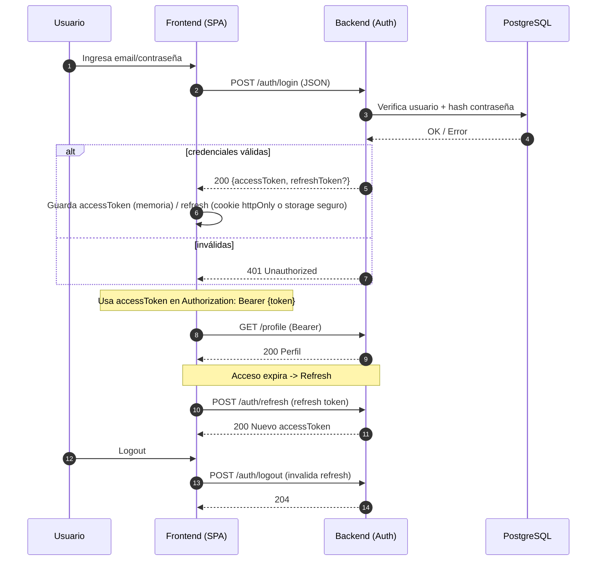
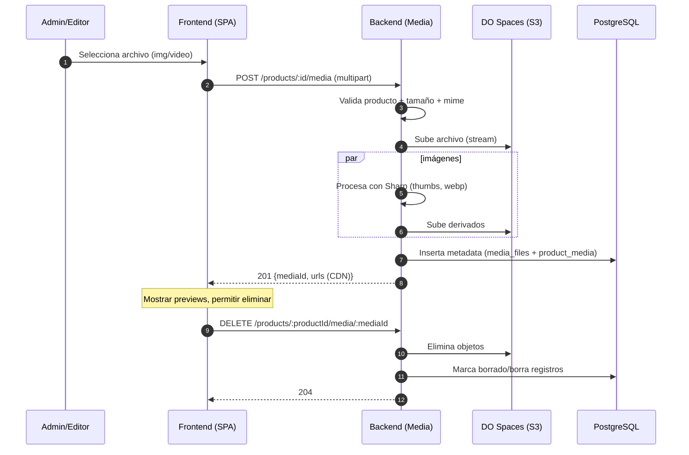
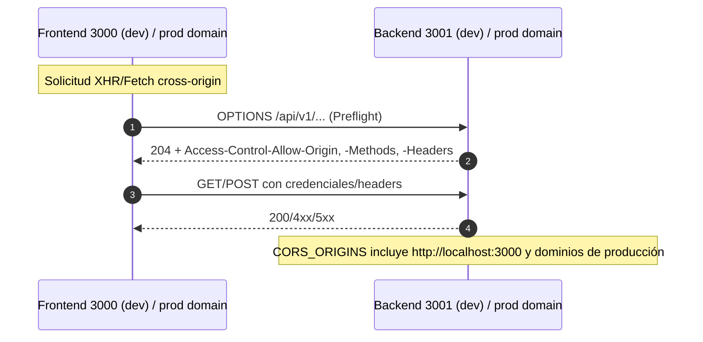
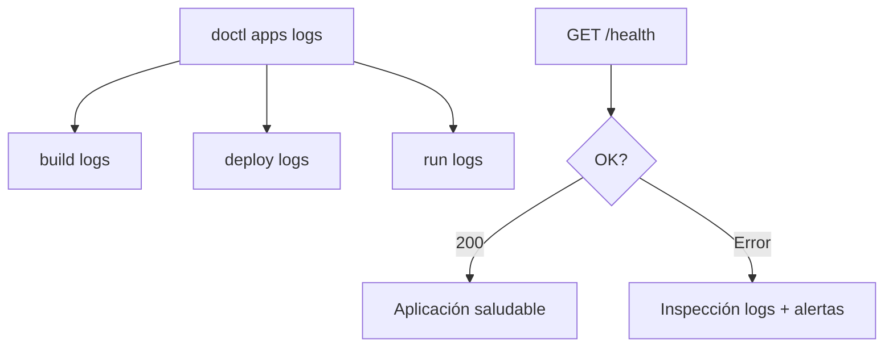
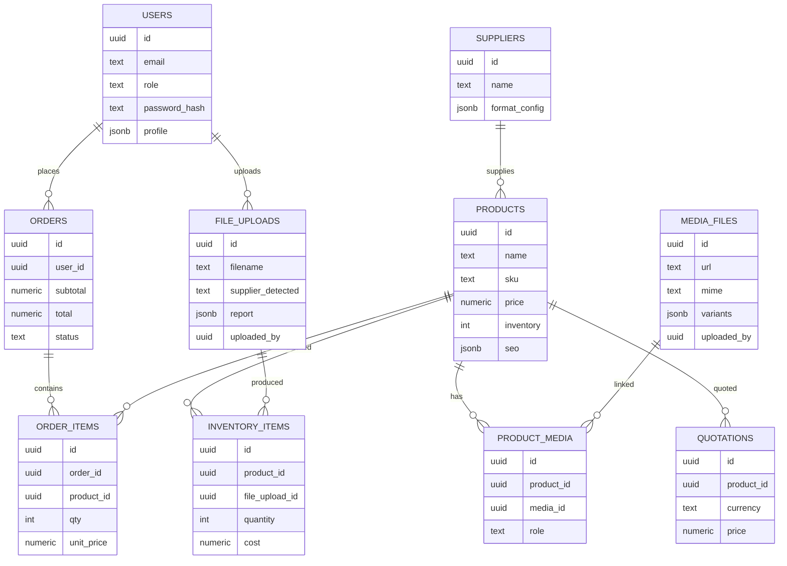

# Diagramas de Flujo — ChefMax LATAM

Este documento recoge los diagramas detallados del flujo de la aplicación ChefMax LATAM (arquitectura, autenticación, procesamiento de Excel, gestión de medios, carrito/checkout, geolocalización, CORS, despliegue, monitoreo y modelo de datos).

Referencias:
- Repos Frontend: `https://github.com/systemadminlightinnoivationsla/chefmax-front`
- Repos Backend: `https://github.com/systemadminlightinnoivationsla/chefmax-backend`
- Guía de despliegue: `docs/DEPLOYMENT.md`
- Nota de puertos locales: `PUERTO_FRONTEND.md`

## Índice

- [1) Arquitectura General del Sistema](#arquitectura)
- [2) Autenticación y Autorización (JWT + Refresh)](#auth)
- [3) Flujo de Procesamiento de Excel Multi‑Formato](#excel)
- [4) Gestión de Medios (Imágenes/Videos por Producto)](#media)
- [5) Carrito y Checkout (E‑commerce)](#carrito)
- [6) Geolocalización y WhatsApp (LATAM)](#geo)
- [7) CORS y Networking (Local y Producción)](#cors)
- [8) Despliegue (DigitalOcean App Platform)](#deploy)
- [9) Monitoreo y Logs](#monitoreo)
- [10) Modelo de Datos (ER)](#er)

## 1) Arquitectura General del Sistema {#arquitectura}

```mermaid
flowchart LR
  subgraph Client[Usuarios / Navegadores]
    A[SPA React (Vite)]
  end

  subgraph Infra[Infraestructura Cloud]
    B[Backend API<br/>Node.js + Express + TS]
    C[(PostgreSQL DO)]
    D[(Redis opcional)]
    E[DO Spaces (S3) <br/> + CDN]
    S[Socket.IO]
  end

  subgraph DevOps[Operaciones]
    G[DigitalOcean App Platform]
    H[doctl CLI / YAML Spec]
  end

  A -- HTTPS /api/v1 --> B
  B <--> C
  B <--> D
  B <--> E
  A <--> S

  H --> G
  G -. despliegue .-> B
  G -. despliegue .-> A
```

## 2) Autenticación y Autorización (JWT + Refresh) {#auth}



## 3) Flujo de Procesamiento de Excel Multi‑Formato {#excel}

```mermaid
flowchart TD
  A[Admin: carga Excel] --> B[SPA react - Dropzone]
  B --> C[POST /uploads (multipart)]
  C --> D[Backend: detección proveedor]
  D --> E[Parse Excel (ExcelJS)]
  E --> F{Múltiples hojas?}
  F -- Sí --> G[Itera hojas relevantes]
  F -- No --> H[Trabaja hoja principal]
  G --> I[Normaliza columnas\n- map por proveedor\n- limpieza de precios\n- formatos numéricos]
  H --> I
  I --> J[Validación por tipos y reglas\n- requeridos\n- rangos\n- catálogos]
  J --> K{Errores?}
  K -- Sí --> L[Genera reporte con filas con error]
  K -- No --> M[Transformación final y upsert]
  M --> N[Persistencia en PostgreSQL\n- products\n- inventory_items\n- file_uploads\n- suppliers]
  N --> O[Emitir eventos Socket.IO\n- progreso\n- resumen]
  L --> O
  O --> P[Respuesta a Frontend:\n- totales\n- errores/advertencias\n- IDs creados]
```

## 4) Gestión de Medios (Imágenes/Videos por Producto) {#media}



## 5) Carrito y Checkout (E‑commerce) {#carrito}

```mermaid
flowchart LR
  A[Usuario navega catálogo] --> B[Añadir al carrito]
  B --> C[CartContext (localStorage)\n- items\n- cantidades\n- subtotal]
  C --> D[Ver carrito (Sidebar/Modal)]
  D --> E[Checkout paso 1: Envío]
  E --> F[Checkout paso 2: Pago]
  F --> G[Crear Orden (POST /orders)]
  G --> H[Validación stock y totales]
  H --> I{Stock OK?}
  I -- No --> J[Respuesta error\n- ajustar cantidades]
  I -- Sí --> K[Persistir order + items]
  K --> L[Respuesta 201 {orderId, estado}]
  L --> M[Confirmación + notificaciones]
```

## 6) Geolocalización y WhatsApp (LATAM) {#geo}

```mermaid
flowchart TD
  A[Inicio SPA] --> B{País en cache?}
  B -- Sí --> C[Usar cache]
  B -- No --> D[Detección por IP]
  D --> E{Éxito?}
  E -- No --> F[Geolocalización navegador]
  F --> G{Éxito?}
  G -- No --> H[Heurística zona horaria]
  E -- Sí --> I[Determina país]
  G -- Sí --> I
  H --> I
  I --> J[Selecciona número WhatsApp por país]
  J --> K[Render WhatsApp Float / CTA]
  I --> L[Localiza contenidos (precio/leyendas)]
  I --> M[Cachear en localStorage]
```

## 7) CORS y Networking (Local y Producción) {#cors}



## 8) Despliegue (DigitalOcean App Platform) {#deploy}

```mermaid
flowchart LR
  Dev[Dev push a GitHub] --> DO[DO App Platform]
  Spec[Spec YAML (p.ej. backend-update.yaml)] --> DO
  CLI[doctl create-deployment <APP_ID>] --> DO

  DO --> Build[Build & Provision]
  Build --> Run[Run containers]
  Run --> Health[Health checks /health]
  Health --> Live[App activa]
  Live --> Logs[Logs build/deploy/run]
```

## 9) Monitoreo y Logs {#monitoreo}



## 10) Modelo de Datos (ER) {#er}



---

Sugerencias de evolución:
- Añadir colas (p.ej. para procesamiento pesado de imágenes/Excel).
- Telemetría/alertas (APM/metrics) y dashboards.
- Endpoints de health detallados (DB, Redis, Spaces).